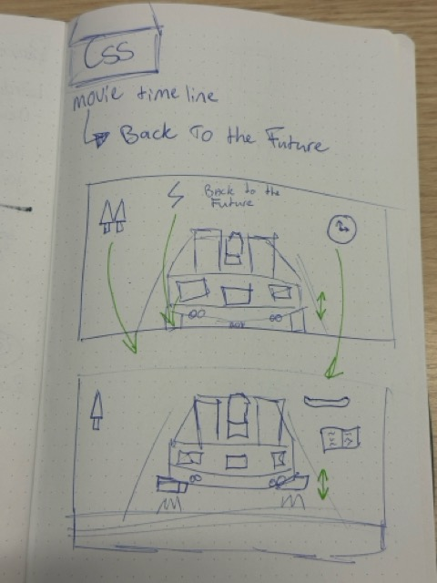
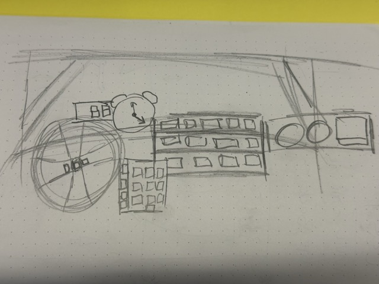

# Back to the Future

 
Voor de Minor WEB Development moeten we met CSS een website maken puur met HTML en CSS  Ik heb gekozen om het dashboard van de Delorean uit Back to the Future 

 <h2> Ideë </h2>
 <h3>Opdracht: Control panel</3>
 
Dashboard van de Delorean. Gemaakt met HTML en CSS

 
Schetsen:

 
 
 
Inspiratie:

 
 
 

